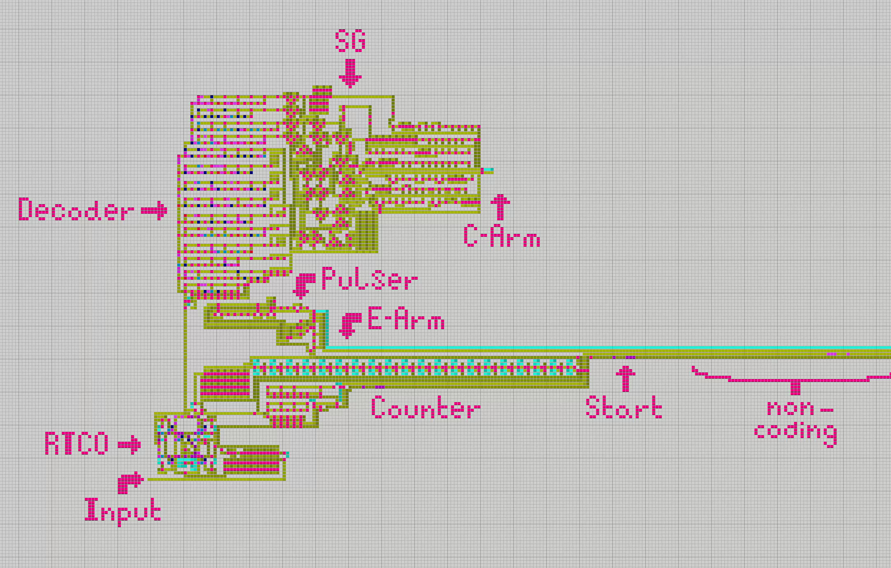
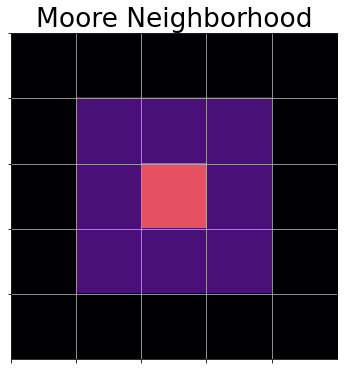
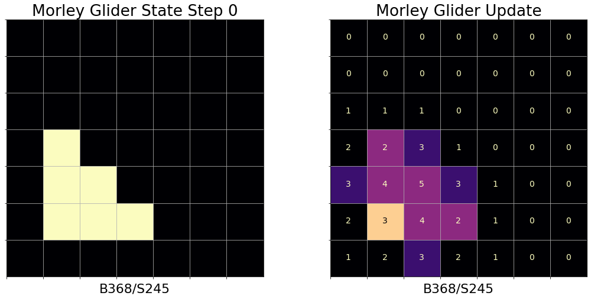
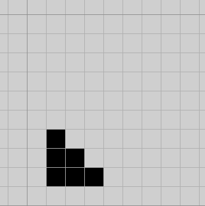
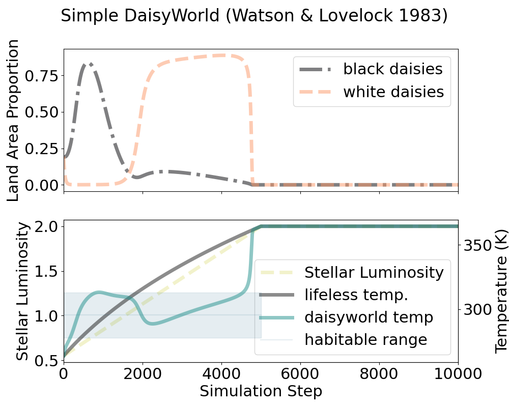
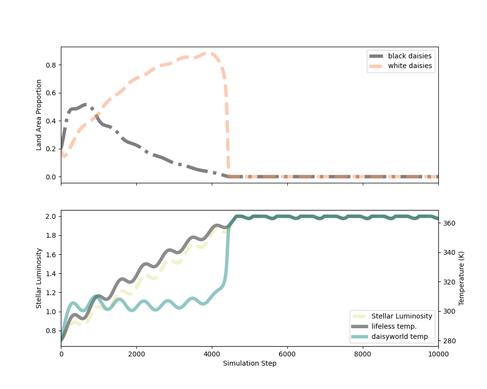

# Cross Labs Alife Summer School

<div align="center">

</div>

## CLASS

* [Syllabus](https://rivesunder.github.io/class/syllabus)
* [Slides](https://rivesunder.github.io/class/entree_toc)


## CLASS code

There are 3 Alife-adjacent substrates we've developed for CLASS exploration and experiment. These are

* `SRNCA` - 
* `dw.simple_dw` -
* `rsvr` - 

In addition to the code developed specifically for CLASS, Golly is another freely available program and a great way to explore cellular automata.

* and [Golly](https://golly.sourceforge.io/)

## Golly Cellular Automata (CA) Simulator

Golly has a gentle and rewarding learning curve _and_ an expansive coverage of different CA systems and patterns. There is an active community of CA enthusiasts on the [conwaylife.com forums](https://conwaylife.com/forums/). Although John Conway's Game of Life was introduced to the public in 1970 (in [Martin Gardner's "Mathematical Games"](https://www.ibiblio.org/lifepatterns/october1970.html) column in Scientific American, [pdf](https://web.archive.org/web/20250202021933/https://web.stanford.edu/class/sts145/Library/life.pdf)) and has been continuously explored and developed for decades, there are still new artifacts and discoveries being made in Life-like CA. See the forum on [Turing-complete Life-like CA](https://conwaylife.com/forums/viewtopic.php?f=11&t=2597&start=125) to get an idea of the scene. 

Golly is already installed in the computers we've set up for in-person CLASS 2025, but Golly is [freely available](https://sourceforge.net/projects/golly/files/golly/golly-4.3/) if you want to run it locally on your own machine and there is also a [web version](https://golly.sourceforge.io/webapp/golly.html) you can run in your browser. 

Golly supports [Life-like CA](https://en.wikipedia.org/wiki/Life-like_cellular_automaton) (of which there are 262,144 different rule variants), the 256 different rule variants of [elementary CA](https://en.wikipedia.org/wiki/Elementary_cellular_automaton), John von Neumann's [original 29-state automaton](https://en.wikipedia.org/wiki/Von_Neumann_cellular_automaton), as well as more exotic options like loops, Turmites, and non-totalistic CA.

<div style="margin: auto; max-width: 100ch;" align="center">
<a href="https://rivesunder.github.io/class/jvn_replicator.html">
 
</a>
<em>A replication machine in John von Neumann's 29-state cellular automaton. Looks complicated! We can start with something simpler.</em>
</div>

### CA Basics

While cellular automata are complex (in fact, many CA are capable of <a href="https://en.wikipedia.org/wiki/Turing_completeness">executing any feasible program</a>), a big part of their appeal is that they can also be very simple. CA generally have three characteristics important for us to consider: states, neighborhoods, and dynamics.

* <strong>States</strong> describe the condition of each cell at any given time.
* <strong>Neighborhoods</strong> define the other cells that a cells can interact with, giving us a concept of <em>locality</em>
* <strong>Dynamics</strong>, or the update rule, determines the way the cell states change over time. In general, the update rule depends on the state of a cell and a cell's neighbors. 

In [Life-like CA](https://en.wikipedia.org/wiki/Life-like_cellular_automaton), cells can have a state of 1 or 0 and update at each time step according to their current state and the state of their neighbors. The neighbors are defined by the _Moore neighborhood_.

<div style="margin: auto; max-width: 100ch;" align="center">
 
</a>
<br>
<em>The Moore neighborhood (in dark purple) and cell state (in light pink).</em>
</div>

<div style="margin: auto; max-width: 100ch;" align="center">
 
<br>
<em>The Life-like CA Morley/Move is defined by the rule string B368/S245. A cell with state zero will change to a state 1 if it has 3, 6, or 8 total neighbors, and a cell with state 1 will remain unchanged with 2, 4, or 5 neighbors. All over cell states will transition to or stay in state 0.</em>
</div>

The CA B368/S245, also known as Morley/Move, is a 2-dimensional Life-like cellular automaton. That means that the dynamics of this CA are defined by each cell state and the sum of cell states in the cell's immediate _Moore neighborhood_, shown above.  


<div style="margin: auto; max-width: 100ch;" align="center">
<a href="https://rivesunder.github.io/class/morley_glider.html">
 
</a>
<br>
<em>The Morley glider in motion</em>
</div>

There's a lot more to explore in Golly, and in CA in general. Hopefully this intro has piqued your interest!

## simple daisyworld

`simple_dw` is an implementation of Watson and Lovelock's original 0-dimensional daisyworld model ([WALO1983](https://onlinelibrary.wiley.com/doi/abs/10.1111/j.1600-0889.1983.tb00031.x), [LO1982, pp. ]())

We've set up a Jupyter notebook for experimenting with Watson and Lovelock's 0-dimensional daisyworld model. To get started, enter 


```
jupyter notebook
```

on the command line. This should open a Jupyter server to the current directory in your default browser. Navigate to the `notebooks` folder. Then, open the `daisyworld.ipynb` notebook. The code for running a daisyworld instance is contained in the notebook, and there are some variables that you can modify to get an idea how the model behaves in different scenarios.

```
## albedo of light and dark daisies
albedo_light_daisies = 0.75
albedo_dark_daisies = 0.25
albedo_ground = 0.5

## starting populations of daisies, in proportion of ground covered
cover_light_daisies = 0.2
cover_dark_daisies = 0.2
cover_arable_ground = 1.0
```

You can change the albedo (amount of light reflected) of the bare ground, light, and dark daisies to be used in the model. You can also change the initial ground coverage by each type of daisy and total amount of soil available for daisies to grow on.

The default scenario is a linear ramp of increasing stellar output, driven by a variable caled `luminosity`. This gradual increase in output mimics the stellar life cycle of our own star, Sol, the Sun. The strength of solar radiation was much weaker in the distant past of the Archaen period, including the time when life (our ancestors) originated. Even though the strength of the sun has increased over time, the temperature of Earth has always stayed in a range that is amenable to supporting life. 

Daisyworld is a simple model that demonstrate homeostatic control of a (very simplified) planetary climate without explicit coordination or a central controller. The daisies proliferate according to a temperature dependent growth rate, and as a consequence of this simple selective pressure the temperature of the planet stays within a viable range much longer than a daisyworld without daisies.

<div style="margin: auto; max-width: 100ch;" align="center">
 
<br>
<em>daisyworld with a linear ramp forcing function
</div>

You can modify the way stellar output changes over time in the daisyworld model by passing a function to the `DaisyWorld` class function `daisyworld.set_forcing_function`. There are a few examples in the notebook to get you started.

```
world = SimpleDaisyWorld()
world.max_L = 2.0

forcing = lambda x, t: (x+world.dL) + 0.0005 * np.sin(t)

world.set_forcing_function(forcing)

world.run_sim()
fig, ax = world.plot_curve()
plt.show()
```

<div style="margin: auto; max-width: 100ch;" align="center">
 
<br>
<em>daisyworld with a forcing function that include a sinusoid
</div>


## rsvr

```
python -m rsvr.simple_reservoir -h

```

```
usage: simple_reservoir.py [-h] [-e ENVIRONMENT_NAME] [-g GENERATIONS] [-d OUT_DIM] [-i ELITES] [-l LIST_AVAILABLE_ENVS] [-m MUTATION_RATE]
                           [-n NUMBER_RUNS] [-o OUTPUT_FOLDER] [-p POPULATION_SIZE] [-r RANDOM_SEED] [-s RESERVOIR_STEPS] [-t TAG]

options:
  -h, --help            show this help message and exit
  -e ENVIRONMENT_NAME, --environment_name ENVIRONMENT_NAME
                        environment for evolving policies. default = InvertedPendulum-v5
  -g GENERATIONS, --generations GENERATIONS
                        number of generations to run, default: 10
  -d OUT_DIM, --out_dim OUT_DIM
                        number of elements in the reservoir output/policy input
  -i ELITES, --elites ELITES
                        number of elites to keep from each generation, default = 0 (no elitism)
  -l LIST_AVAILABLE_ENVS, --list_available_envs LIST_AVAILABLE_ENVS
                        To list available environments, pass argument '--list_available_envs 1' or '-l 1'
  -m MUTATION_RATE, --mutation_rate MUTATION_RATE
                        mutation rate in avg number of mutations per individual policy each generation. default is 1. This determines the
                        probability of any given element of each policy mutating as `m/out_dim`
  -n NUMBER_RUNS, --number_runs NUMBER_RUNS
                        number of runs per policy to calculate fitness, default: 3
  -o OUTPUT_FOLDER, --output_folder OUTPUT_FOLDER
                        folder to store results. default is `results`
  -p POPULATION_SIZE, --population_size POPULATION_SIZE
                        number of individuals in a population at each generation
  -r RANDOM_SEED, --random_seed RANDOM_SEED
                        used to initialise pseudorandom number generator,default = 196884
  -s RESERVOIR_STEPS, --reservoir_steps RESERVOIR_STEPS
                        steps through reservoir, per time step. default is 3
  -t TAG, --tag TAG     tag for labeling experiments default: default_tag
```


```
python rsvr/simple_reservoir.py --list_available_envs 1

```

```
InvertedPendulum-v5
HalfCheetah-v5
```


